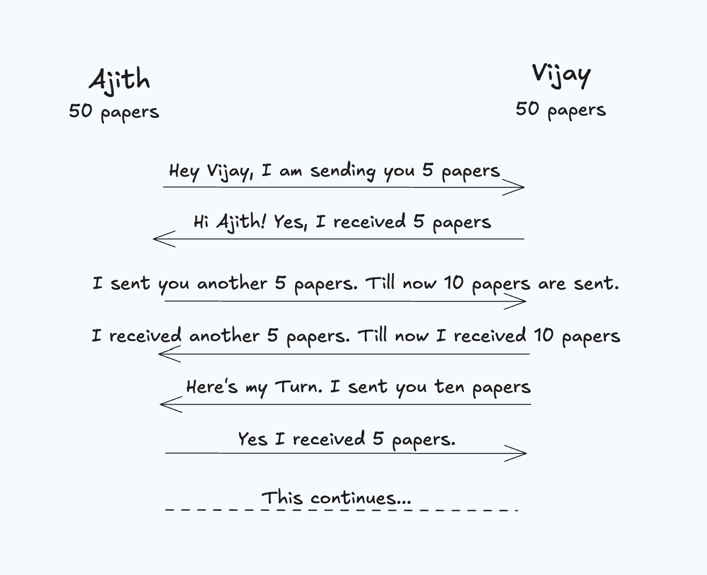
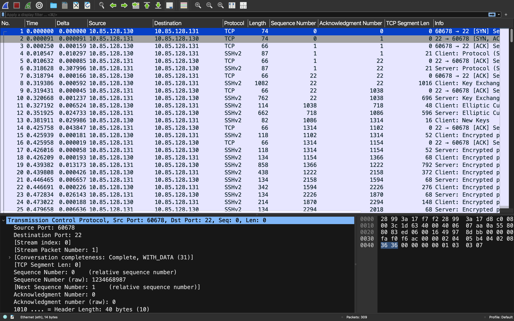

# Understanding Sequence and Acknowledgement Numbers

Think of this scenario. Ajith and Vijay have 100 papers each and need to exchange them by ensuring they receive each other’s papers without missing them. The point to note here is that they can send a max of 10 papers in one go. They decided to tell each other how many papers they received each time. Here is the flow,

As you can see in the above flow, each is communicating what they have received. This idea is implemented in TCP. Let’s understand this further by walking through the packet capture. I have a packet capture of an SSH session between two devices. As you are aware, SSH uses TCP as its transport layer protocol.

We’ll go through maybe 10 packets, and I’ll leave others to you to look at. Also, I’ve added the Sequence Number, Acknowledgement Number, and TCP Segment Len columns in Wireshark to ease our understanding. As you know, a TCP connection will start with the 3-way handshake. We’ll refer .130 to A and .131 to B.

Packet-1: The initiator (A) sent a TCP packet with a SYN bit set. The point to note here is the segment length is 0. The sequence number will be a 32-bit number where it is chosen at random. The acknowledgment number is 0. SEQ-0, ACK-0

Packet-2: In response, B sent a packet with both SYN and ACK flags set. It chose a sequence number at random, and the acknowledgment number is 0 initially. As to indicate A, that it received the previous packet, it increments the acknowledgment to 1. This is known as a ghost byte as the segment length is 0. SEQ-0, ACK-1

Packet-3: The sequence number is incremented by 1 as it received an ACK from B for its previous packet. SEQ-1, ACK-1

Packet-4: A sent a packet with a segment length of 21 bytes. The point to note here is that SEQ and ACK numbers are unchanged when compared with the previous packet. SEQ-1, ACK-1

Packet-5: B sent a packet by incrementing its ACK number. The point to note here is that it also increases its sequence number by 1 as it’s received ACK for its previous packet from A. SEQ-1, ACK-22.

Packet-6: B sent a packet with a segment length of 21. SEQ-1, ACK-22

Packet-7: A sent a packet by incrementing its ACK number. SEQ-22, ACK-22

Packet-8: A sent a packet with a segment length of 1016 bytes. SEQ-22, ACK-22

Packet-9: B sent a packet by incrementing its ACK number. SEQ-22, ACK-1038

Packet-10: B sent a packet with a segment length of 696 bytes. SEQ-22, ACK-1038

Packet-11: A sent a packet segment size of 48 bytes. Also, it acknowledged the previous packet sent by B. SEQ-1038, ACK-718
