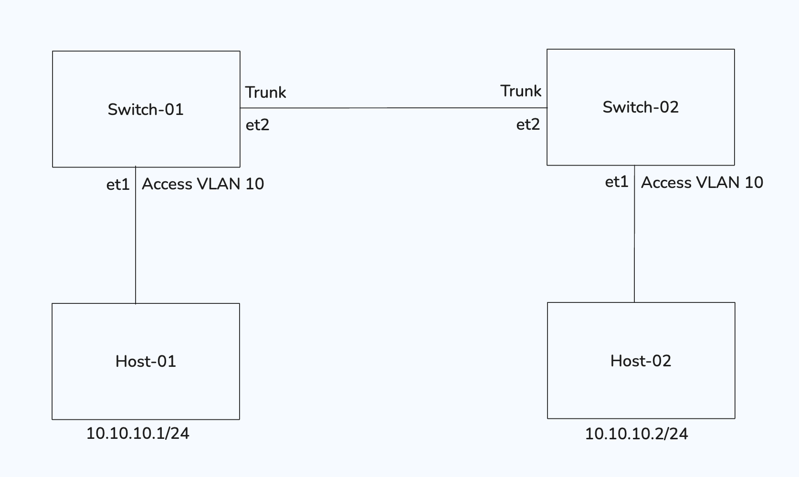
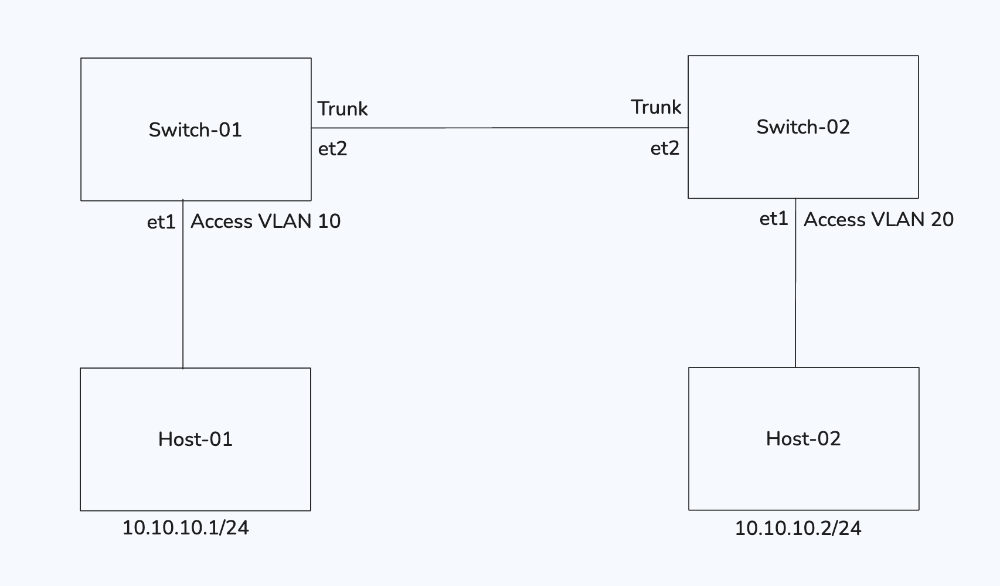
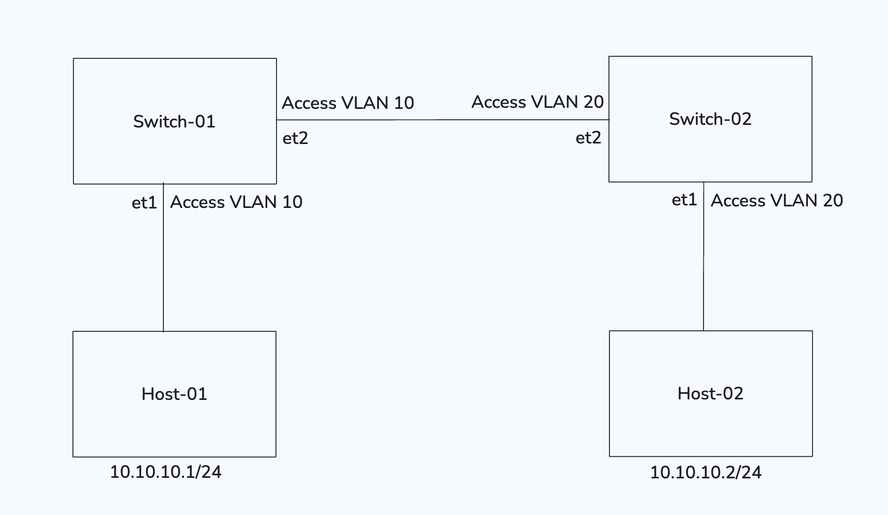
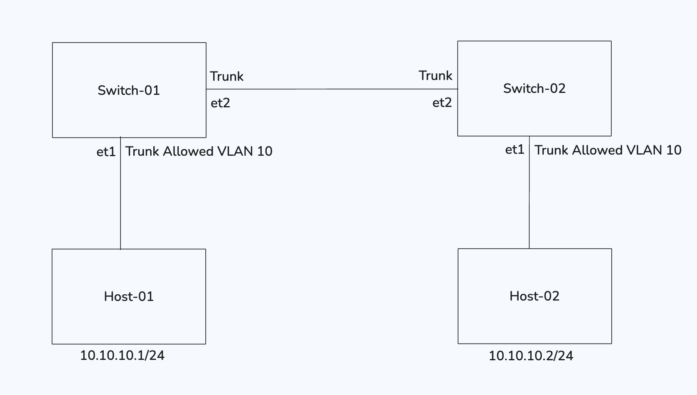
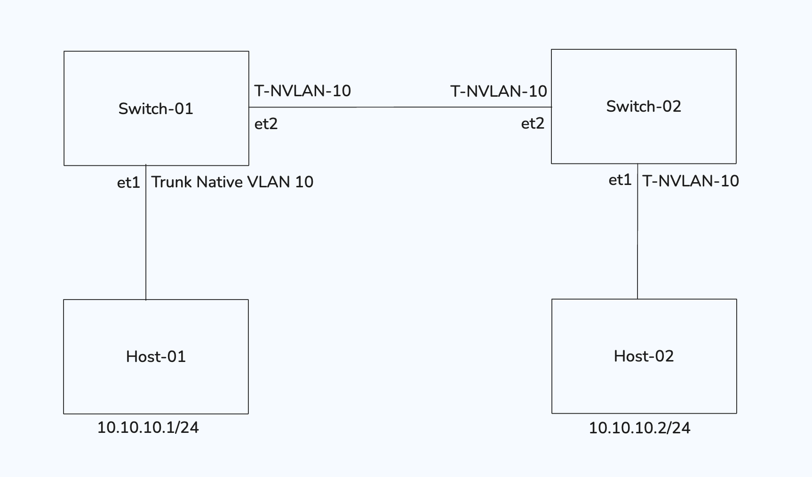
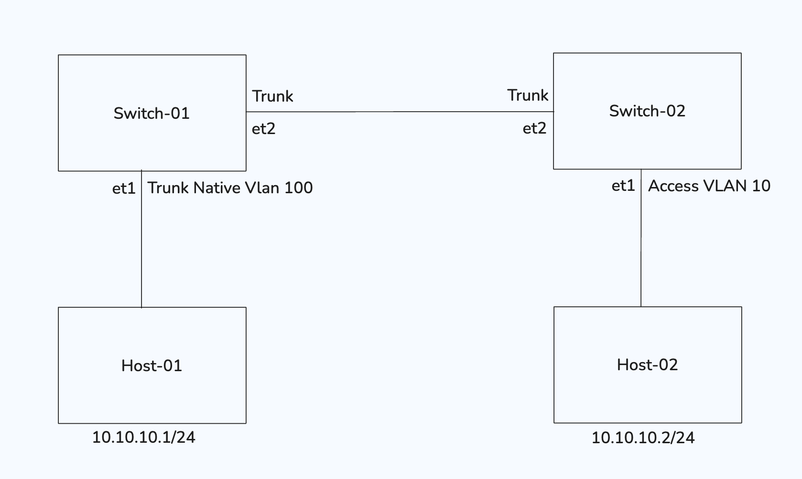
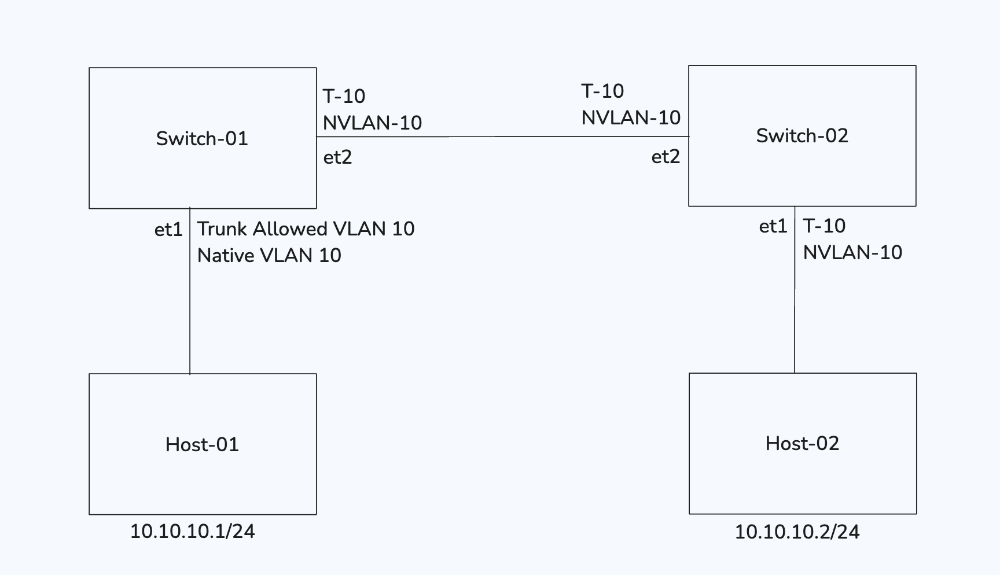

# VLAN Workbook

The topology is uniform in every scenarios consisting of 2 switches and 2 host devices. You task is to find if ping work from Host-01 to Host-02. If not then you need to find more than one possible solutions to make it work.

## Scenario-1:
<!--  -->

Will the ping work between Host-01 to Host-02? 

## Scenario-2:

Will the ping work between Host-01 to Host-02? If not then how it can be resolved?

## Scenario-3:

One change when compared to scenario-2 is that the port configuration is changed between switches? Will the ping work now?

## Scenario-4:

In this scenario the ports to hosts devices are configured as Trunk, also the allowed VLAN is configured as VLAN 10.

## Scenario-5:

Every port of switches are configured as Trunk Native VLAN 10.

## Scenario-6:

Switch-01's Port to Host-01 is configured as Trunk Native VLAN 100 and Switch-02'1 port to Host-02 is configured as Access VLAN 10.

## Scenario-7:

Every port of switches are configured as Trunk Allowed VLAN 10 and Native VLAN are also 10.